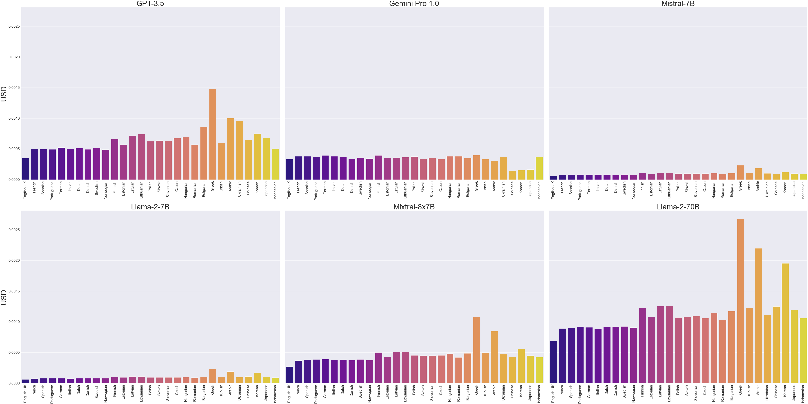
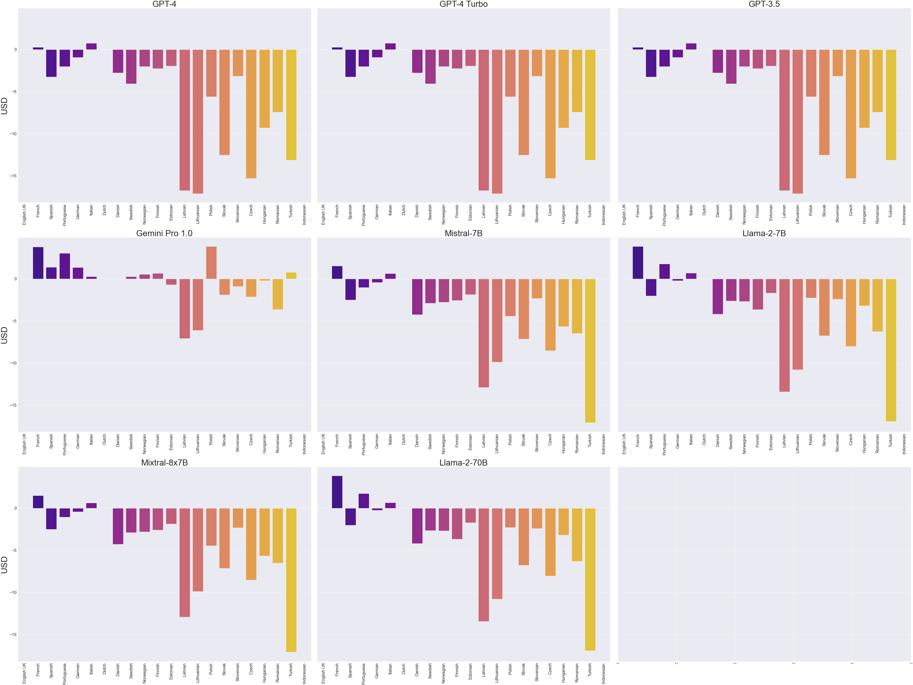

# Are LLMs smarter in some languages than others? 

## Tokens

For deeper insights about token go to [tokens.ipynb](tokens.ipynb)

### TL;DR

#### Price comparison to process same text in various LLMs

#### Price comparison to process same text in various LLMs with GPT-4

#### Change in number of tokens when diacritics is removed

## Embeddings

For deeper insights about token go to [embeddings.ipynb](embeddings.ipynb)

### TL;DR

#### Cosine similarity to same texts in various languages

#### Difference Cosine similarity to slightly rephrased texts in various languages

## Reasoning

TODO

