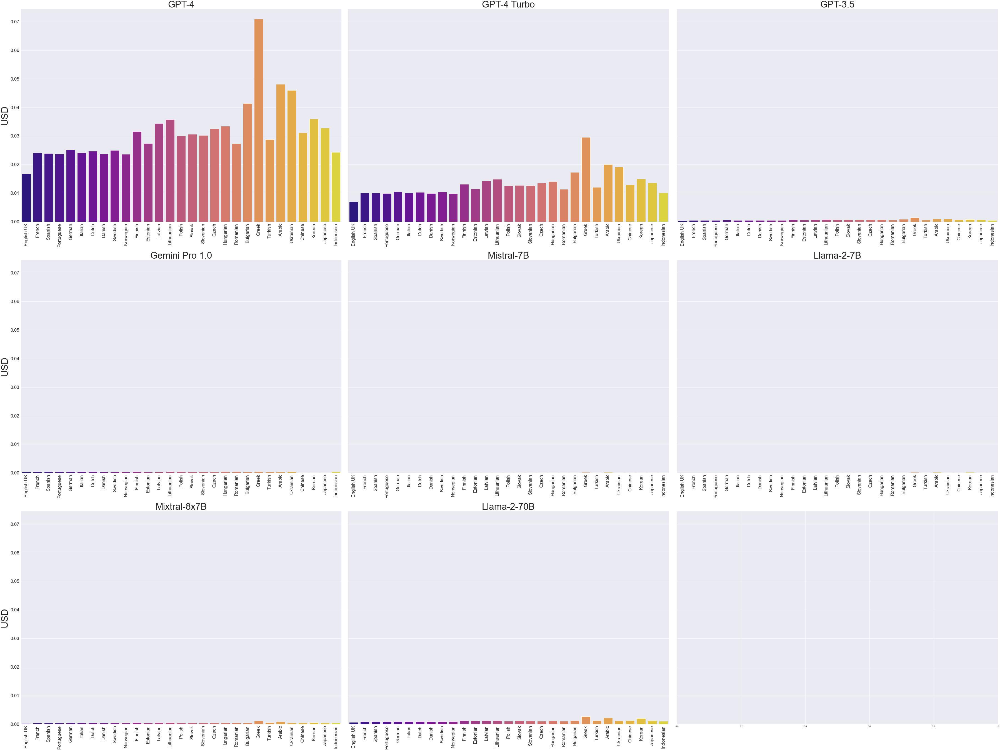
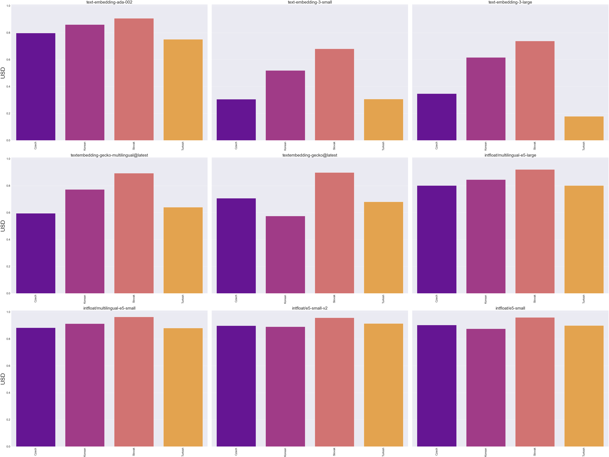

# LLMs across languages

In this repository was done research for my presentation 

## Tokens

#### Price comparison to process same text in various LLMs

#### Price comparison to process same text in various LLMs with GPT-4

#### Change in number of tokens when diacritics is removed

## Embeddings

#### Cosine similarity to same texts in various languages

#### Difference Cosine similarity to slightly rephrased texts in various languages

## Reasoning

